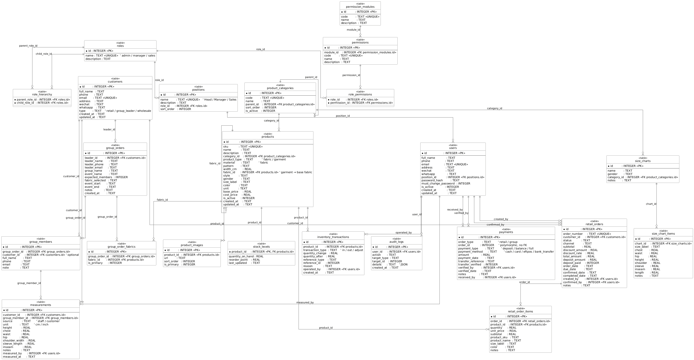

Lucky Star 企业信息管理系统 & 网站 — 项目需求说明书（工程师拟定版）
编写者：Vincent Yu（系统架构与开发负责人）
版本：V1.0
日期：2025 年 11 月 20 日

1. 项目背景与目标
Lucky Star 位于奥克兰 Otahuhu，是一家以布料零售、成衣销售、定制裁剪、团体订单服务为核心的服装企业。
客户群体以本地及大洋洲太平洋裔社区为主，具备明显的文化设计偏好、团购需求与现场量体流程。
随着订单量持续增长，企业逐渐面临以下问题：
•	进货、出货、库存盘点依赖人工记录，容易遗漏
•	团体客户信息复杂（学校、教会），难以管理与追踪
•	量体数据散落于纸张、口述、手机短讯，不易统一存档
•	客户希望可以在线浏览产品并自主下单
•	企业内部缺乏统一的角色权限管理、操作日志管理
为此，本项目旨在为 Lucky Star 构建：
一个全新的一体化企业信息管理系统（后端） + 对外网站系统（前端）
实现：
•	产品、布料、成衣、定制的统一数据管理
•	现货与定制订单的流转管理
•	团体订单与成员量体的专业管理
•	客户的在线浏览与下单
•	企业内部的权限体系与操作审计
•	基于 SQLite 的稳定、轻量级进销存
本系统将成为 Lucky Star 未来 5–10 年的基础信息平台。

2. 系统总体架构
后端：
•	Node.js + Express REST API
•	SQLite 单文件数据库
•	基于严谨 ERD 的实体层（已完成）
前端：
•	SvelteKit（SSR）
•	产品浏览、在线下单、订单查询
•	内部后台管理界面（Admin Portal）
服务器部署：
•	Nginx 作反向代理
•	独立运行前端（SSR）
•	后端使用 Node 服务
•	数据库文件持久化存储

3. 系统功能模块需求（基于 ERD + 业务分析）
以下内容是规范化需求，未来开发的 API、前端 UI、权限控制全部以此为依据。

3.1 进销存模块（Inventory & Product Management）
3.1.1 产品分类管理
支持三级分类结构：
•	布料（Fabric）
•	成衣（Garment）
o	男装（Mens）
o	女装（Womens）
o	男童装（Boys）
o	女童装（Girls）
3.1.2 产品库（Products）
系统支持统一管理两大类产品：
(1) 布料 Fabric
•	材质（material）
•	花纹（pattern）
•	幅宽（width_cm）
•	颜色（color）
(2) 成衣 Garment
•	关联布料（fabric_id）
•	款式（style）
•	性别（gender）
•	尺码（size_label）
•	颜色（color）
每个产品支持：
•	多图片（含主图）
•	描述
•	库存量自动汇总
3.1.3 库存系统（Stock Levels）
库存自动管理：
•	禁止直接修改库存（trigger 已实现）
•	自动更新库存（trigger 已实现）
•	支持三类流水：
o	入库（in）
o	出库（out）
o	调整（adjust）
由系统自动记录：
•	操作人（operated_by）
•	前后库存量
支持盘点功能（HEAD 或经理执行调整）。

3.2 客户管理模块（Customers）
支持三类客户类型：
•	retail（普通零售客户）
•	group_leader（学校/教会团体负责人）
•	wholesale（可扩展）
客户包含：
•	姓名
•	电话（必填）
•	email（必填）
•	地址
•	微信 / WhatsApp
•	创建、更新时间自动记录（trigger 已实现）

3.3 团体订单系统（Group Orders）
每年 Lucky Star 接待大量团体（学校、教会、社区），系统需支持专业的团体结构。
3.3.1 团体订单（Group Orders）
包含：
•	团体 leader（外键 customers）
•	leader 快照（姓名/电话/email）
→ 确保历史正确性
•	团体名称、活动名称、活动起止时间
•	成员数量预估
•	选定布料（fabric_selected 或 product_id 方案）
•	多布料绑定（group_order_fabrics）
3.3.2 团体成员（Group Members）
包含：
•	可选关联 customer_id（避免重复登记）
•	姓名、电话、email（电话必填）
•	备注 note
3.3.3 团体量体（Measurements）
系统支持录入：
•	身高 / 胸围 / 腰围 / 臀围 / 肩宽 / 袖长 / 裤长等
所有量体关联：
•	customer 或 group_member（二选一）
•	测量人（staff）
•	测量时间

3.4 零售订单系统（POS Retail Orders）
支持：
•	订单编号自动生成
•	订单状态流转：
o	pending
o	confirmed
o	completed
o	cancelled
字段包括：
•	subtotal
•	discount
•	deposit
•	total
•	due_date（预计完成日期）
•	操作人：created_by / confirmed_by
明细记录：
•	SKU
•	名称
•	尺码快照
•	颜色快照
•	数量
•	小计

3.5 支付记录（Payments）
支持：
•	零售订单付款
•	团体订单付款
•	支持多种方式：现金/卡/EFTPOS/银行转账
•	分期付款架构：订金 / 余款 / 全额
对银行转账支持：
•	转账码（transfer_reference）
•	核实状态（transfer_verified）
•	核实人 verified_by
•	核实时间 verified_date
满足多次分次支付需求。

3.6 尺码表系统（Size Charts）
Lucky Star 采用自有尺码表，系统支持：
•	多套尺码表（男装、女装、儿童等）
•	各尺码的详细身体参数：
o	胸围
o	腰围
o	臀围
o	身高
o	肩宽
o	袖长
o	裤长
o	衣长
供客户在线下单时参考。

3.7 在线产品浏览 / 客户下单（Website Frontend）
客户从官网可：
✔ 浏览成衣产品
按：
•	类别
•	颜色
•	尺码
•	库存状态
•	价格
✔ 浏览布料（Fabric）
按：
•	面料材质
•	颜色
•	花纹
•	可预约定制
✔ 在线下单
客户可以在前端填写：
•	量体数据（cm/inch）
•	选定产品与尺寸
•	备注说明
•	联系方式
系统保存为零售订单（retail_orders）。

3.8 角色与权限管理（RBAC）
系统有三类员工角色：
•	admin
•	manager
•	sales
具备：
•	角色继承
•	权限节点（细颗粒度）
•	职位 Position → Role 绑定
•	审计日志记录所有关键动作
满足可扩展性（未来可加 warehouse、finance 等）。

4. 数据库设计（ERD）
基于上述需求，本系统的数据库使用 SQLite，结构包括：
•	roles / positions / users
•	customers
•	group_orders
•	group_members
•	products / product_images
•	stock_levels / inventory_transactions
•	retail_orders / retail_order_items
•	size_charts / size_chart_items
•	measurements
•	payments
•	audit_logs
所有外键关系、触发器已经完备（见附录 ERD）。
 




# Lucky Star Backend - 项目结构

```
backend/
├── src/
│   ├── app.js                         # Express 应用主配置
│   ├── server.js                      # 服务器入口（监听端口）
│   │
│   ├── database/
│   │   ├── db.js                      # SQLite 连接 & 初始加载
│   │   ├── init-db.sql                # 全量数据库 Schema + 触发器
│   │   └── migrations/                # 将来用于结构迁移
│   │       └── README.md
│   │
│   ├── middleware/
│   │   ├── auth.js                    # STAFF JWT 鉴权中间件
│   │   ├── customerAuth.js            # ⭐ CUSTOMER JWT 鉴权（网站用户）
│   │   ├── rbac.js                    # STAFF RBAC 权限控制
│   │   └── errorHandler.js            # 全局错误处理
│   │
│   ├── utils/
│   │   ├── jwt.js                     # JWT 签名 / 验证工具
│   │   ├── password.js                # bcrypt 密码工具
│   │   ├── validate.js                # 通用字段验证
│   │   ├── logger.js                  # Winston 日志
│   │   └── fileService.js             # ⭐ NEW 文件写入/删除（multer）
│   │
│   ├── data/                          # DAO 层：SQLite 最低层
│   │   ├── users-dao.js               # staff 用户表
│   │   ├── customers-dao.js           # 网站客户
│   │   ├── products-dao.js            # 产品
│   │   ├── product-images-dao.js      # ⭐ NEW 产品图片 DAO
│   │   ├── orders-dao.js              # 零售订单
│   │   ├── measurements-dao.js        # 量体数据
│   │   ├── payments-dao.js            # 支付
│   │   ├── sizechart-dao.js           # 尺码表
│   │   └── audit-dao.js               # 审计日志
│   │
│   ├── services/                      # 业务逻辑层
│   │   ├── authService.js             # STAFF 认证 / 登录 / 重置密码
│   │   ├── customerAuthService.js     # ⭐ CUSTOMER 注册 / 登录 / Token
│   │   ├── userService.js             # STAFF 用户管理
│   │   ├── customerService.js         # 客户/团体/量体管理
│   │   ├── productService.js          # 产品管理
│   │   ├── productImageService.js     # ⭐ NEW 产品图片上传/删除
│   │   ├── retailOrderService.js      # 零售订单服务
│   │   ├── paymentService.js          # 支付服务
│   │   ├── measurementService.js      # 量体记录
│   │   ├── sizechartService.js        # 尺码表
│   │   └── auditService.js            # 审计日志写入
│   │
│   └── routes/
│       ├── api.js                     # API 总路由（聚合所有子路由）
│       ├── authRoutes.js              # STAFF 登录 / 登出 / 权限
│       ├── customerAuthRoutes.js      # ⭐ CUSTOMER 注册 / 登录
│       ├── userRoutes.js              # STAFF 管理用户
│       ├── customerRoutes.js          # 管理 Customer / 团体 / 量体
│       ├── productRoutes.js           # 产品 CRUD
│       ├── productImageRoutes.js      # ⭐ NEW 产品图片上传/排序/删除
│       ├── retailOrderRoutes.js       # 订单 CRUD + 订单详情
│       ├── paymentRoutes.js           # 支付记录
│       ├── measurementRoutes.js       # 量体上传（后台）
│       ├── sizechartRoutes.js         # 尺码表
│       └── auditRoutes.js             # 查看审计日志
│
├── uploads/                           # ⭐ NEW — 运行时动态生成目录
│   └── products/                      # 产品图（由 multer 创建）
│
├── scripts/
│   ├── generate-hash.js               # bcrypt 工具
│   ├── create-admin.js                # 创建 HEAD 管理员
│   ├── test-init-db.js                # 测试初始化数据库
│   ├── seed-dev-data.js               # 开发环境模拟数据
│   ├── seed-test-data.js              # 生成测试库存
│   ├── backup-db.js                   # 数据库备份
│   ├── check-db-health.js             # DB 健康检查
│   └── reset-dev.sh                   # 一键重置开发 DB
│
├── data/
│   └── app.db                         # SQLite（生产 / 开发）
│
├── .env                               # 环境变量（生产）
├── .env.development                   # 环境变量（开发）
├── .env.example                       # 模板
├── .gitignore
├── package.json
├── README.md
└── PROJECT_STRUCTURE.md

---

主要特点

SQLite 单文件数据库（WAL 模式），所有表结构由 init-db.sql 管理。

Inventory 采用触发器保护：禁止直接写入，必须走 inventoryService。

统一三层架构：Routes → Services → DAO → SQLite。

测试与生产共用同一 SQL Schema；测试区块位于文件末端，默认注释。

环境变量

开发

NODE_ENV=development
DB_MODE=dev


生产

NODE_ENV=production
DB_MODE=prod


DB_MODE=prod 会启用库存写保护。

常用脚本
npm run db:init        # 初始化数据库（使用 init-db.sql）
npm run db:reset       # 清空 + 初始化 + 测试数据
npm run db:seed:dev    # 添加开发样例数据
npm run admin:create   # 创建管理员账号
npm run db:health      # 查看数据库状态
npm run db:backup      # 手动备份
npm run dev            # 启动开发服务器


# Lucky Star Frontend - 项目结构

```
frontend/
├── src/
│   ├── app.html
│   ├── app.css
│
│   ├── routes/
│   │   ├── +layout.svelte
│   │   ├── +layout.server.js
│   │   ├── +error.svelte
│   │   ├── +page.svelte
│   │   ├── +page.server.js
│   │
│   │   ├── about/
│   │   │   └── +page.svelte
│   │
│   │   ├── products/
│   │   │   ├── +page.server.js
│   │   │   └── +page.svelte
│   │   │
│   │   │   ├── fabrics/
│   │   │   │   ├── +page.server.js
│   │   │   │   ├── +page.svelte
│   │   │   │   └── [id]/
│   │   │   │       ├── +page.server.js
│   │   │   │       └── +page.svelte
│   │   │
│   │   │   ├── garments/
│   │   │   │   ├── +page.server.js
│   │   │   │   ├── +page.svelte
│   │   │   │
│   │   │   │   ├── mens/
│   │   │   │   │   ├── +page.server.js
│   │   │   │   │   ├── +page.svelte
│   │   │   │   │   └── [id]/
│   │   │   │   │       ├── +page.server.js
│   │   │   │   │       └── +page.svelte
│   │   │   │
│   │   │   │   ├── womens/
│   │   │   │   │   ├── +page.server.js
│   │   │   │   │   ├── +page.svelte
│   │   │   │   │   └── [id]/
│   │   │   │   │       ├── +page.server.js
│   │   │   │   │       └── +page.svelte
│   │   │   │
│   │   │   │   ├── boys/
│   │   │   │   │   ├── +page.server.js
│   │   │   │   │   ├── +page.svelte
│   │   │   │   │   └── [id]/
│   │   │   │   │       ├── +page.server.js
│   │   │   │   │       └── +page.svelte
│   │   │   │
│   │   │   │   └── girls/
│   │   │   │       ├── +page.server.js
│   │   │   │       ├── +page.svelte
│   │   │   │       └── [id]/
│   │   │   │           ├── +page.server.js
│   │   │   │           └── +page.svelte
│   │   │
│   │   │   └── item/
│   │   │       └── [id]/
│   │   │           ├── +page.server.js
│   │   │           └── +page.svelte
│   │
│   │   ├── sizechart/
│   │   │   ├── +page.server.js
│   │   │   └── +page.svelte
│   │
│   │   ├── checkout/
│   │   │   ├── +page.server.js
│   │   │   ├── +page.svelte
│   │   │   ├── custom/
│   │   │   │   ├── +page.server.js
│   │   │   │   ├── +page.svelte
│   │   │   │   └── measurement/
│   │   │   │       ├── +page.server.js
│   │   │   │       └── +page.svelte
│   │   │   └── success/
│   │   │       └── +page.svelte
│   │
│   │   ├── auth/
│   │   │   ├── login/
│   │   │   │   ├── +page.server.js
│   │   │   │   └── +page.svelte
│   │   │   ├── register/
│   │   │   │   ├── +page.server.js
│   │   │   │   └── +page.svelte
│   │   │   └── logout/
│   │   │       └── +server.js
│   │
│   │   ├── my/
│   │   │   ├── +layout.server.js
│   │   │   ├── +page.svelte
│   │   │   ├── +layout.svelte
│   │   │   ├── +page.sever.js
│   │   │
│   │   │   ├── cart/
│   │   │   │   └── +page.svelte
│   │   │
│   │   │   ├── orders/
│   │   │   │   ├── +page.server.js
│   │   │   │   ├── +page.svelte
│   │   │   │   └── [id]/
│   │   │   │       ├── +page.server.js
│   │   │   │       └── +page.svelte
│   │   │
│   │   │   ├── measurements/
│   │   │   │   ├── +page.server.js
│   │   │   │   └── +page.svelte
│   │   │
│   │   │   └── profile/
│   │   │       ├── +page.server.js
│   │   │       └── +page.svelte
│   │
│   │   ├── admin/
│   │   │   ├── +layout.server.js
│   │   │   ├── +layout.svelte
│   │   │
│   │   │   ├── dashboard/
│   │   │   │   ├── +page.server.js
│   │   │   │   └── +page.svelte
│   │   │
│   │   │   ├── products/
│   │   │   │   ├── +page.server.js
│   │   │   │   ├── +page.svelte
│   │   │   │   ├── create/
│   │   │   │   │   ├── +page.server.js
│   │   │   │   │   └── +page.svelte
│   │   │   │   └── [id]/
│   │   │   │       ├── edit/
│   │   │   │       │   ├── +page.server.js
│   │   │   │       │   └── +page.svelte
│   │   │   │       └── images/
│   │   │   │           ├── +page.server.js
│   │   │   │           └── +page.svelte
│   │   │
│   │   │   ├── inventory/
│   │   │   │   ├── +page.server.js
│   │   │   │   ├── +page.svelte
│   │   │   │   ├── transactions/
│   │   │   │   │   ├── +page.server.js
│   │   │   │   │   └── +page.svelte
│   │   │   │   ├── in/
│   │   │   │   │   ├── +page.server.js
│   │   │   │   │   └── +page.svelte
│   │   │   │   ├── out/
│   │   │   │   │   ├── +page.server.js
│   │   │   │   │   └── +page.svelte
│   │   │   │   └── adjust/
│   │   │       └── +page.svelte
│   │   │
│   │   │   ├── retail-orders/
│   │   │   │   ├── +page.server.js
│   │   │   │   ├── +page.svelte
│   │   │   │   ├── pending/
│   │   │   │   │   ├── +page.server.js
│   │   │   │   │   └── +page.svelte
│   │   │   │   ├── create/
│   │   │   │   │   ├── +page.server.js
│   │   │   │   │   └── +page.svelte
│   │   │   │   └── [id]/
│   │   │   │       ├── +page.server.js
│   │   │   │       ├── +page.svelte
│   │   │   │       ├── review/
│   │   │   │       │   ├── +page.server.js
│   │   │   │       │   └── +page.svelte
│   │   │   │       └── complete/
│   │   │           └── +page.server.js
│   │   │
│   │   │   ├── group-orders/
│   │   │   │   ├── +page.server.js
│   │   │   │   ├── +page.svelte
│   │   │   │   ├── create/
│   │   │   │   │   ├── +page.server.js
│   │   │   │   │   └── +page.svelte
│   │   │   │   └── [id]/
│   │   │   │       ├── +page.server.js
│   │   │   │       ├── +page.svelte
│   │   │   │       ├── members/
│   │   │   │       │   ├── +page.server.js
│   │   │   │       │   ├── +page.svelte
│   │   │   │       │   ├── add/
│   │   │   │       │   │   ├── +page.server.js
│   │   │   │       │   │   └── +page.svelte
│   │   │   │       │   └── [memberId]/
│   │   │   │       │       ├── edit/
│   │   │   │       │       │   ├── +page.server.js
│   │   │   │       │       │   └── +page.svelte
│   │   │   │       │       └── measurement/
│   │   │   │       │           ├── +page.server.js
│   │   │   │       │           └── +page.svelte
│   │   │   │       └── fabrics/
│   │   │   │           ├── +page.server.js
│   │   │   │           └── +page.svelte
│   │   │
│   │   │   ├── customers/
│   │   │   │   ├── +page.server.js
│   │   │   │   ├── +page.svelte
│   │   │   │   ├── create/
│   │   │   │   │   ├── +page.server.js
│   │   │   │   │   └── +page.svelte
│   │   │   │   └── [id]/
│   │   │   │       ├── +page.server.js
│   │   │   │       ├── +page.svelte
│   │   │   │       ├── edit/
│   │   │   │       │   ├── +page.server.js
│   │   │   │       │   └── +page.svelte
│   │   │   │       ├── measurements/         # ⭐ 客户下的量体入口（新增点）
│   │   │   │           └── create/
│   │   │   │               ├── +page.server.js
│   │   │   │               └── +page.svelte

│   │   │
│   │   │   ├── measurements/                 # ⭐ 管理后台 Measurement 列表页（新增模块）
│   │   │   │   ├── +page.server.js
│   │   │   │   ├── +page.svelte
│   │   │   │   └── [id]/                     # ⭐ 量体记录查看页（只读）
│   │   │   │       ├── +page.server.js
│   │   │   │       └── +page.svelte
│   │   │
│   │   │   ├── payments/
│   │   │   │   ├── +page.server.js
│   │   │   │   ├── +page.svelte
│   │   │   │   ├── create/
│   │   │   │   │   ├── +page.server.js
│   │   │   │   │   └── +page.svelte
│   │   │   │   └── verify/
│   │   │   │       ├── +page.server.js
│   │   │   │       └── +page.svelte
│   │   │
│   │   │   ├── size-charts/
│   │   │   │   ├── +page.server.js
│   │   │   │   ├── +page.svelte
│   │   │   │   ├── create/
│   │   │   │   │   ├── +page.server.js
│   │   │   │   │   └── +page.svelte
│   │   │   │   └── [id]/
│   │   │   │       ├── edit/
│   │   │   │       │   ├── +page.server.js
│   │   │   │       │   └── +page.svelte
│   │   │   │       └── items/
│   │   │   │           ├── +page.server.js
│   │   │   │           └── +page.svelte
│   │   │
│   │   │   ├── users/
│   │   │   │   ├── +page.server.js
│   │   │   │   ├── +page.svelte
│   │   │   │   ├── create/
│   │   │   │   │   ├── +page.server.js
│   │   │   │   │   └── +page.svelte
│   │   │   │   └── [id]/
│   │   │   │       ├── edit/
│   │   │   │       │   ├── +page.server.js
│   │   │   │       │   └── +page.svelte
│   │   │   │       └── permissions/
│   │   │   │           ├── +page.server.js
│   │   │   │           └── +page.svelte
│   │   │
│   │   │   └── audit/
│   │   │       ├── +page.server.js
│   │   │       └── +page.svelte
│   │
│   │   ├── api/
│   │   │   └── +server.js
│   │
│   │   ├── sitemap.xml
│   │   └── robots.txt
│
│   ├── lib/
│   │   ├── server/
│   │   │   ├── api.js
│   │   │   ├── auth.js
│   │   │   ├── permissions.js
│   │   │   └── db.js
│   │
│   │   ├── components/
│   │   │   ├── admin/
│   │   │   │   ├── Sidebar.svelte
│   │   │   │   ├── DataTable.svelte
│   │   │   │   ├── StatusBadge.svelte
│   │   │   │   ├── PermissionGuard.svelte
│   │   │   │   └── Pagination.svelte
│   │   │   ├── forms/
│   │   │   │   ├── ProductForm.svelte
│   │   │   │   ├── MeasurementForm.svelte
│   │   │   │   ├── OrderForm.svelte
│   │   │   │   ├── CustomerForm.svelte
│   │   │   │   └── Input.svelte
│   │   │   ├── common/
│   │   │   │   ├── Header.svelte
│   │   │   │   ├── Footer.svelte
│   │   │   │   ├── LoadingSpinner.svelte
│   │   │   │   ├── Modal.svelte
│   │   │   │   ├── Toast.svelte
│   │   │   │   └── Card.svelte
│   │   │   └── products/
│   │   │       ├── ProductCard.svelte
│   │   │       ├── ProductFilter.svelte
│   │   │       └── ProductGallery.svelte
│   │
│   │   ├── stores/
│   │   │   ├── auth.js
│   │   │   ├── cart.js
│   │   │   ├── notifications.js
│   │   │   └── ui.js
│   │
│   │   ├── utils/
│   │   │   ├── format.js
│   │   │   ├── validation.js
│   │   │   ├── constants.js
│   │   │   ├── currency.js
│   │   │   └── measurement.js
│   │
│   │   └── types/
│   │       ├── index.d.ts
│   │       ├── product.d.ts
│   │       ├── order.d.ts
│   │       └── user.d.ts
│
│   ├── hooks.server.js
│
├── static/
│   ├── images/
│   ├── fonts/
│   └── favicon.png
│
├── tests/
│   ├── unit/
│   ├── integration/
│   └── e2e/
│
├── .env
├── .env.development
├── .env.example
├── svelte.config.js
├── vite.config.js
├── tailwind.config.js
├── package.json
└── .gitignore


---

## 📝 架构说明

### 1. 路由层级设计原则
- **前台路由**（`/products`, `/fabrics`, `/order`）：面向客户，SEO 友好，SSR 渲染
- **客户中心**（`/my`）：登录客户查看订单、量体记录
- **后台管理**（`/admin`）：需权限验证，完整的 ERP 功能

### 2. SSR 与权限控制
```javascript
// src/hooks.server.js - 全局认证拦截
export async function handle({ event, resolve }) {
  const token = event.cookies.get('token');
  if (token) {
    const user = await verifyToken(token);
    event.locals.user = user;
  }
  return resolve(event);
}

// src/routes/admin/+layout.server.js - 后台权限验证
export async function load({ locals }) {
  if (!locals.user || !locals.user.permissions.includes('admin.access')) {
    throw redirect(302, '/auth/login');
  }
  return { user: locals.user };
}
```

### 3. 核心业务流程映射
| 业务场景 | 前端路由 | 后端 API |
|---------|---------|---------|
| 团体订单创建 | `/admin/group-orders/create` | `POST /api/group-orders` |
| 团体成员量体 | `/admin/group-orders/[id]/members/[memberId]/measurement` | `POST /api/measurements` |
| 库存盘点 | `/admin/inventory/adjust` | `POST /api/inventory/adjust` |
| 银行转账核实 | `/admin/payments/verify` | `PATCH /api/payments/[id]/verify` |

### 4. 技术栈推荐
- **框架**: SvelteKit（SSR + SSG）
- **样式**: Tailwind CSS
- **状态管理**: Svelte Stores
- **表单验证**: Zod（前后端共享 Schema）
- **HTTP 客户端**: 原生 fetch（封装在 `lib/server/api.js`）
- **日期处理**: date-fns
- **图表**: Chart.js 或 Apache ECharts

### 5. 关键文件说明
- **`hooks.server.js`**: 全局拦截器，验证 JWT 并设置 `event.locals.user`
- **`lib/server/api.js`**: 封装后端 API 调用（统一错误处理、Token 注入）
- **`lib/server/permissions.js`**: RBAC 权限检查工具
- **`lib/components/admin/DataTable.svelte`**: 可复用表格组件（支持排序、筛选、分页）

### 6. 环境变量示例
```bash
# .env.example
PUBLIC_API_URL=http://localhost:3000
SECRET_JWT_KEY=your-jwt-secret
```

---

## 🚀 下一步开发建议
1. **第一阶段**：实现基础认证（登录/登出）+ 产品浏览
2. **第二阶段**：后台核心功能（产品管理、库存管理）
3. **第三阶段**：团体订单系统（Lucky Star 的核心竞争力）
4. **第四阶段**：支付与审计日志
5. **第五阶段**：性能优化（图片 CDN、缓存策略）